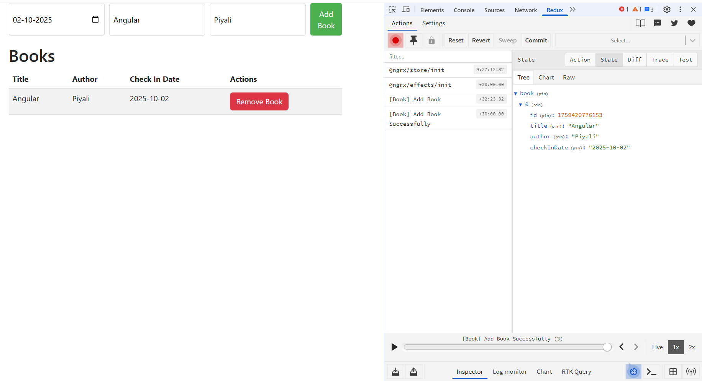

# 📚 BookManagement with Hybrid (NGRX Store + NGRX Signal Store)


[tailwindcss](https://tailwindcss.com/docs/installation/framework-guides/angular)



    -   NgRx Store → manages global book catalog (shared data across app, persisted, complex workflows).
    -   NgRx Signal Store → manages local UI state (filters, sort order, selected book, modal open/close).

Global State (NgRx Store)
    -   Books list (fetched from API / persisted in DB)
    -   Add, remove, update book
    -   Async side effects (API calls, caching, etc.)

Local UI State (NgRx Signal Store)
    -   Current filter (by author, title)
    -   Sort order (by title/date)
    -   Selected book for details
    -   Whether the “Add Book” dialog is open

## Facade Service
Creating a Facade Service for your book feature is an excellent architectural decision — it hides NgRx complexity (selectors, dispatches, signals) behind a clean, component-friendly API.

🎯 Why Use a Facade?

A facade acts as a bridge between your components and NgRx Store.

✅ Keeps components thin and declarative
✅ Encapsulates selectors, actions, and UI signals
✅ Simplifies testing (mock the facade instead of the store)
✅ Makes migration to signals or other stores easier later

| Section                         | Purpose                                              |
| ------------------------------- | ---------------------------------------------------- |
| `books$`                        | Direct observable of all books from the NgRx Store   |
| `filter` & `sortBy`             | Signals from `BookUIStore`                           |
| `add()`, `remove()`, `update()` | Simple dispatch wrappers                             |
| `updateById()`                  | Uses selector `selectBookById` to edit specific book |
| `setFilter()` & `setSort()`     | Delegate UI state changes to `BookUIStore`           |


## ✅ Workflow Now

    -   On app start → dispatches loadBooks → Effect fetches from API → populates global store.
    -   Add Book → dispatches addBook → POST to API → reloads list.
    -   Remove Book → dispatches removeBook → DELETE from API → reloads list.

***Fake REST API using json-server (or any mock backend).***
Example data: db.json with books.
```
Run npx json-server --watch db.json --port 3000.
```

## 🏗 What’s Inside

    -   NgRx Store (classic) → manages the global book catalog (state/book.reducer.ts, book.actions.ts, book.selectors.ts).
    -   NgRx Signal Store → manages UI state (filter, sort, selected book, add dialog) in book-ui.store.ts.
    -   Hybrid Component (book-list.component.ts) → uses both together:
        -   Fetches global books list via NgRx Store.
        -   Uses Signal Store for filtering, sorting, and UI toggles.

## Mock db json
```
{
  "books": [
    { "id": 1, "title": "Angular Signals", "author": "Mark Thompson", "checkInDate": "2025-10-01" },
    { "id": 2, "title": "NgRx in Action", "author": "Mike Ryan", "checkInDate": "2025-09-15" }
  ]
}

```