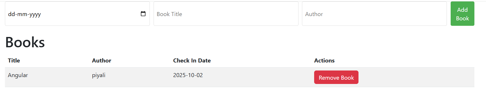

# BookManagement with NGRX Signal Store



### 🟢 NgRx Signal Store (new signals-based store)

Paradigm: Built on Angular signals instead of Observables.

Simpler API: Define state with withState(), and mutations with withMethods().

State Access: State values are signals, consumed directly in templates without async pipe.

Boilerplate Reduction: No need for actions/reducers/selectors.

### 🟡 When to Use NgRx Signal Store

👉 Best for feature-level state, smaller apps, or when signals fit better than Observables.

### Real-world scenarios:

1. Small to medium apps (internal dashboards, CRUD tools)

  - Example: Admin dashboard with user management.
  - State changes are simple (add user, edit user, remove user).
  - Using actions/reducers would be overkill — Signal Store keeps it clean.

2. Feature-level state in large apps

  - Example: A form wizard inside a large banking app.
  - You don’t need global reducers just for this feature.
  - Signal Store can manage form state (current step, user input) locally.

3. Apps heavily using Angular Signals already

  - Example: A blog app where filtering posts, toggling dark mode, etc.
  - Direct signals → no need to wrap with observables.

4. Prototyping & fast-moving apps

  - Signal Store has less boilerplate, so you can build & iterate faster.

### book store
```
export const BookStore = signalStore(
  { providedIn: 'root' },
  withState(initialState),
  withMethods((store) => ({
    addBook(book: Omit<Book, 'id'>) {
      const newBook: Book = { ...book, id: Date.now() }; // simple ID
      patchState(store, { books: [...store.books(), newBook] });
    },
    removeBook(id: number) {
      patchState(store, { books: store.books().filter(b => b.id !== id) });
    }
  }))
);
```
✅ Key Points
    -   signalStore automatically exposes books as a signal (so you can do store.books() in components).
    -   patchState is the recommended way to update immutable state.
    -   The addBook method uses Omit<Book, 'id'> to ensure the UI/form doesn’t need to provide an id.
    -   Date.now() is a quick ID generator — in real-world apps, you’d likely use a UUID or backend-generated ID.

#### Let’s break this down step by step so it’s super clear why signalStore, withState, and withMethods exist and how they work together in Angular 19 with NgRx Signals.

🔹 signalStore

signalStore is a function from @ngrx/signals that lets you create a store powered by Angular Signals.
It gives you:
    -   Reactive state (like signals, but managed with structure).
    -   A central place for your app’s state and logic.
    -   An injectable service (by default providedIn: 'root').

Think of it as a mini NgRx store but without reducers, actions, or effects — just plain signals with some helpers.
```
export const MyStore = signalStore(
  { providedIn: 'root' },
  // features like state, methods, computed selectors go here
);
```

When you inject MyStore in a component, you get:
    -   Signals for state (store.books())
    -   Methods you defined (store.addBook())

🔹 withState(initialState)

withState defines the initial state of the store and makes it reactive.
It takes a plain object and turns each property into a signal.

Example:
```
withState({
  books: []
})
```

This means store.books() is now a signal that you can read in components:

<li *ngFor="let book of store.books()">{{ book.title }}</li>


And you can update it using patchState or setState.

🔹 withMethods((store) => ({ ... }))

withMethods lets you attach custom methods (like add/remove/update logic) to the store.
These methods can:
    -   Read the current state (store.books())
    -   Update the state (patchState)

Example:
```
withMethods((store) => ({
  addBook(book) {
    patchState(store, { books: [...store.books(), book] });
  },
  removeBook(id) {
    patchState(store, { books: store.books().filter(b => b.id !== id) });
  }
}))
```


Now in components you can call:
```
store.addBook({ title: 'Angular Mastery', author: 'Jane Doe', checkInDate: '2025-10-02' });
store.removeBook(123);
```

⚡ Putting It All Together
```
export const BookStore = signalStore(
  { providedIn: 'root' },         // ✅ creates an injectable store
  withState({ books: [] }),       // ✅ state as signals
  withMethods((store) => ({       // ✅ attach custom logic
    addBook(book) { /* ... */ },
    removeBook(id) { /* ... */ }
  }))
);
```

    -   signalStore → wraps everything
    -   withState → reactive state
    -   withMethods → store logic


### NgRx Signal Store vs NgRx Store
| Feature            | NgRx Store (Classic)                         | NgRx Signal Store                             |
| ------------------ | -------------------------------------------- | --------------------------------------------- |
| **Underlying**     | RxJS Observables                             | Angular Signals                               |
| **Boilerplate**    | High (actions, reducers, effects, selectors) | Low (just state + methods)                    |
| **Async Handling** | Effects (powerful but verbose)               | Signals (side effects handled via `effect()`) |
| **DevTools**       | Full Redux DevTools support                  | Limited but improving                         |
| **Learning Curve** | Steeper                                      | Easier                                        |
| **Use Case**       | Large/enterprise apps with complex flows     | Simpler apps or feature stores                |
