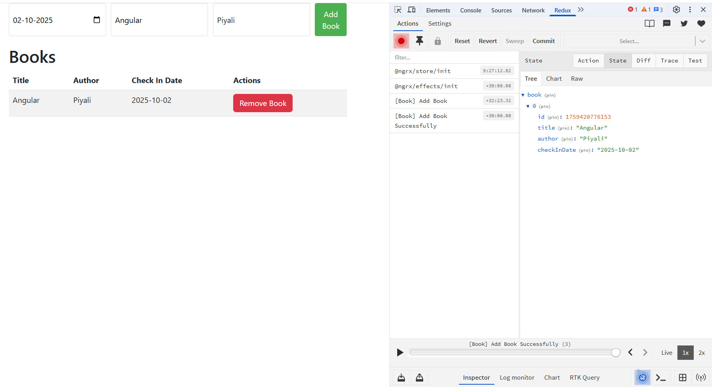

# BookManagement with NGRX Store

🟢 NgRx Store (classic Redux-style state management)

Paradigm: Based on RxJS Observables + Redux pattern (actions → reducers → state).

Boilerplate: Requires actions, reducers, selectors, effects (for side effects).

State Access: You select data using store.select(selector) which returns an Observable. You subscribe in components (often via async pipe).

👉 Best For:

    -   Large-scale apps
    -   Complex state transitions
    -   Heavy async workflows (API calls, side effects, middleware)
    -   When you want time-travel debugging & strong devtools

🟢 When to Use NgRx Store (classic Redux-style)

👉 Best for enterprise-scale, multi-team apps where you need structure, debugging, and complex workflows.

1. Real-world scenarios:

    -   Large e-commerce platform (e.g., Amazon-like app)
    -   Global state shared across many modules: cart, user profile, orders, payments, products.
    -   Complex async flows: checkout → payment → inventory update → confirmation.
    -   Time-travel debugging to track issues in dev.

2. Banking/Insurance application

    -   Critical workflows where state transitions need to be explicit & auditable.
    -   Example: Loan application → approval → disbursement → notifications.
    -   NgRx Store + Effects let you manage these chains cleanly.

3. Healthcare or Government apps

    -   Regulations often require predictable state transitions.
    -   With reducers & actions, you can log every state change for auditing.

4. Apps with real-time data sync (chat, stock market, IoT dashboards)

    -   Store selectors + RxJS operators help manage websockets, polling, and live updates.

